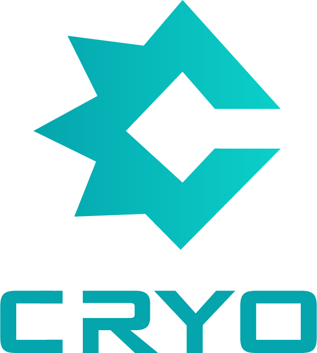

<div align="center">
  
  <h1>The Cryo Programming Language</h1>
  <p><i>A statically-typed, compiled systems language with a self-hosted compiler and an LLVM 20 backend.</i></p>
  <h3><b>v1.0.0</b></h3>
  <p>
    <a href="https://github.com/jakelequire/CryoLang/actions/workflows/ci.yml?query=branch%3Amain"></a>
  </p>
</div>

---

```cryo
namespace Hello;

function main() -> int {
    printf("Hello, world!\n");
    return 0;
}
```

Cryo gives systems programmers explicit control over memory and data layout (manual allocation, raw pointers, no GC) alongside the language constructs that make modern programs tractable: generics, algebraic enums, pattern matching, traits, single-inheritance classes, and a module system. Generics are monomorphised, so the abstractions compile down to the same code you would write by hand.

The compiler is **self-hosted**: every line of Cryo you compile is compiled by Cryo. The standard library is written in Cryo. The bundled HTTP server, JSON parser, hash maps, and test framework are written in Cryo. Every build target drives off the pinned compiler at `bin/cryo` (committed to the repo).

> **The full language reference lives at [`docs/cryo.md`](./docs/cryo.md).** This README is the thirty-second tour and the install / build instructions.

---

## Table of Contents

- [Highlights](#highlights)
- [Installing](#installing)
- [Hello, World](#hello-world)
- [Language Tour](#language-tour)
- [The `cryo` CLI](#the-cryo-cli)
- [Project Layout (`cryoconfig`)](#project-layout-cryoconfig)
- [Standard Library](#standard-library)
- [Building from Source](#building-from-source)
- [Architecture](#architecture)
- [Repository Layout](#repository-layout)
- [Status & Roadmap](#status--roadmap)
- [License](#license)

---

## Installing

### Quick install (recommended)

One line installs a self-contained `cryo` (the compiler statically links LLVM, so there's no `libLLVM` runtime dependency) into `~/.cryo` and adds it to your `PATH`:

**Linux x86-64:**
```bash
curl -fsSL https://cryo-lang.org/install.sh | bash
```

**Windows x86-64** (PowerShell):
```powershell
irm https://cryo-lang.org/install.ps1 | iex
```

Open a new shell, then `cryo --version`. To pin a version or remove the install:

```bash
curl -fsSL https://cryo-lang.org/install.sh | bash -s -- --version=1.0.0
~/.cryo/bin/cryo --version          # or: cryo --uninstall via the script
```

> **One runtime requirement:** compiling a program shells out to a system C compiler/linker for the final link. Install one if you don't have it — `gcc`/`clang` on Linux, a mingw-w64 `gcc` on Windows. The `cryo` binary itself needs nothing.

### From source / for compiler development

The repo ships a committed self-hosted compiler at `bin/cryo` and a stdlib at `stdlib/`. `./install.sh --dev` symlinks them into your `$PATH` (no download) and builds the stdlib archive on first run:

```bash
git clone https://github.com/jakelequire/CryoLang.git
cd CryoLang
./install.sh --dev                 # → /usr/local/bin/cryo, /usr/local/share/cryo/stdlib
./install.sh --dev --prefix=$HOME/.local
./install.sh --dev --uninstall
```

`make install` runs `./install.sh --dev` for you. To rebuild the compiler from source, see [Building from Source](#building-from-source).

### Requirements

The **quick-install** binary is statically linked — it only needs a C compiler on `PATH` to link the programs you compile. The table below applies to the **from-source / dev** flow (the pinned `bin/cryo` is dynamically linked):

| Dependency | Version | Why |
| --- | --- | --- |
| `clang` | 20 | Linker driver invoked at compile time. |
| `LLVM` | 20 (runtime + dev) | The pinned `bin/cryo` dynamically links `libLLVM.so.20.1`. The `-dev` package is additionally required to rebuild the compiler from source. |
| `make` | 4.0+ | Top-level build orchestration. |
| `python3` | 3.8+ | Drives `make selfhost-check`. |
| `glibc` | 2.34+ | Floor of the committed pinned `bin/cryo` (Ubuntu 22.04+, Debian 12+, Fedora 35+). The quick-install binary is fully static and has no glibc requirement. |

The pinned `bin/cryo` is an x86-64 Linux ELF dynamically linked against `libLLVM.so.20.1` (plus `libstdc++`, `libffi`, `libedit`, `libxml2`, `libicu`, `libz`, `libzstd`, `liblzma`, and glibc). On Debian/Ubuntu, `apt-get install llvm-20 clang-20` covers the runtime; rebuilding from source additionally needs `llvm-20-dev` (and `libpolly-20-dev` for a `--release-static` build). The dev install also runs `make stdlib` to produce `stdlib/.bin/libcryo.a` (which is gitignored), so a clean checkout needs the build toolchain even when using the pinned binary.

---

## Hello, World

Scaffold a new project:

```bash
cryo init hello
cd hello
```

`cryo init` is interactive - pressing Enter accepts every default. When invoked as `cryo init <dir>` the directory becomes the default project name; piping empty lines (`yes "" | cryo init hello`) accepts every prompt non-interactively.

This produces:

```
hello/
├── cryoconfig
└── src/
    └── main.cryo
```

`src/main.cryo`:

```cryo
namespace Hello;

function main() -> int {
    printf("Hello, world!\n");
    return 0;
}
```

Build and run:

```bash
cryo run
```

`cryo build` compiles to `build/hello` (the final binary is hoisted to the
build root; intermediates live under `build/target/<profile>/`, grouped per
package: `std/`, `local/`, and one subtree per dependency). `cryo run` builds
and executes.

---

## Language Tour

A condensed walk-through. Every construct here has a dedicated section in [`docs/cryo.md`](./docs/cryo.md).

### Variables

```cryo
const name: string = "Cryo";   // immutable
mut counter: int   = 0;        // mutable
counter = counter + 1;
```

Type annotations are required. Mutability is opt-in.

### Control flow

```cryo
if (x > 0) { printf("positive\n"); }
else if (x < 0) { printf("negative\n"); }
else { printf("zero\n"); }

for (mut i: int = 0; i < 10; i++) { printf("%d\n", i); }

loop {
    if (done) { break; }
}

const parity: string = match (n % 2) {
    0 => { "even" }
    1 => { "odd"  }
    _ => { "?"    }
};
```

### Structs

```cryo
type struct Rect {
    width:  int;
    height: int;

    static new(w: int, h: int) -> Rect {
        return Rect { width: w, height: h };
    }

    area(&this) -> int {
        return this.width * this.height;
    }

    scale(mut &this, factor: int) -> void {
        this.width  = this.width  * factor;
        this.height = this.height * factor;
    }
}
```

### Classes: single inheritance, virtual dispatch

```cryo
type class Animal {
public:
    name: string;
    Animal(_name: string) { this.name = _name; }
    virtual speak(&this) -> void;
}

type class Dog : Animal {
public:
    Dog() : Animal("Dog") {}
    override speak(&this) -> void { printf("%s: Woof!\n", this.name); }
}

function make_speak(a: Animal*) -> void {
    a.speak();   // dispatched via vtable
}
```

### Enums and pattern matching

```cryo
type enum Shape {
    Circle(f64);
    Rectangle(f64, f64);
    Point;
}

function describe(s: Shape) -> void {
    match (s) {
        Shape::Circle(r)        => { printf("Circle r=%f\n", r); }
        Shape::Rectangle(w, h)  => { printf("Rect %f x %f\n", w, h); }
        Shape::Point            => { printf("A point\n"); }
    }
}
```

### Traits and generics

```cryo
type trait Eq {
    equals(&this, other: &This) -> boolean;
}

implement trait Eq for i32 {
    equals(&this, other: &i32) -> boolean { return this == *other; }
}

function find<T>(xs: &Array<T>, target: T) -> Option<u64>
    where T: Eq + Copy {
    for (mut i: u64 = 0; i < xs.length(); i++) {
        const item: T = xs.get(i).unwrap();
        if (item.equals(&target)) {
            return Option::Some(i);
        }
    }
    return Option::None;
}
```

### Modules

```cryo
// math/_module.cryo
namespace Math;

public module math::vector;
public module math::matrix;
```

```cryo
// math/vector.cryo
namespace Math::Vector;

type struct Vec2 {
public:
    x: f64;
    y: f64;

    static new(x: f64, y: f64) -> Vec2 { return Vec2 { x: x, y: y }; }
}
```

```cryo
import Math::Vector;

function main() -> int {
    const v: Vec2 = Vec2::new(1.0, 2.0);
    return 0;
}
```

Items are private by default; `public` exports them.

### FFI

```cryo
// Declare individual C functions by hand:
extern "C" {
    function strlen(s: string) -> u64;
}

// …or import a whole C header under an alias. Quoted includes resolve
// relative to the source file; angle-bracket includes use the system
// search path, exactly as in C.
c := extern "C" {
    #include <stdio.h>
}

function main() -> int {
    const n: u64 = strlen("hello");
    c::printf("strlen = %lu\n", n);
    return 0;
}
```

The `c := extern "C" { #include … }` form imports a real C header. The compiler invokes `clang` to preprocess it and synthesises bindings under the named alias. Don't also hand-declare a symbol that the imported header defines (e.g. `puts` from `<stdio.h>`) — call it through the alias (`c::puts`) instead.

### Tests

```cryo
![config(testing)]
namespace MyApp::Tests;

import std::test::assert::{ expect_eq };

![test]
function addition_is_commutative() -> Result<(), TestError> {
    return expect_eq(1 + 2, 2 + 1);
}
```

Run with `cryo test`. See [`docs/cryo.md` § 20](./docs/cryo.md#20-testing).

---

## The `cryo` CLI

| Command | Description |
| --- | --- |
| `cryo init [dir]` | Scaffold a new project (`cryoconfig` + `src/main.cryo`). |
| `cryo build` | Build the project in the current directory. |
| `cryo build --opt-level=N` | Override the optimization level (`0`–`3`) for this build. |
| `cryo build -g` | Emit DWARF debug info (source file/line) for gdb/lldb backtraces. |
| `cryo run` | Build and execute. |
| `cryo test [filter]` | Discover, build, and run every `![test]` function. |
| `cryo test --list` | Print discovered tests without running. |
| `cryo test --ignored` | Also run `![ignore]`-marked tests. |
| `cryo check <file>` | Type-check without code generation. |
| `cryo fetch` | Resolve `[dependencies]`; write `cryoconfig.lock`. |
| `cryo update` | Re-resolve dependencies, ignoring the lock. |
| `cryo demangle <symbol>` | Decode a mangled Cryo symbol. |
| `cryo version` | Print version info. |

Run `cryo help` for the canonical list.

---

## Project Layout (`cryoconfig`)

A Cryo project is a directory containing a `cryoconfig` file at its root. The file is TOML-like.

```toml
[project]
project_name = "my_app"
output_dir   = "build"
target_type  = "executable"           # or "library", "stdlib"
source_dir   = "src"
entry_point  = "src/main.cryo"

[compiler]
debug     = false
optimize  = "O2"                       # O0 (debuggable) .. O3; default O2

[link]
system = ["sqlite3"]                   # system libs (-l); see `cryo help config`

[dependencies]
cqlite = { git = "https://github.com/jakelequire/cqlite.git", version = "0.1.0" }
```

**Multi-target projects** declare additional binary targets with `[[bin]]`:

```toml
[[bin]]
name        = "tool"
entry_point = "src/tool/main.cryo"
```

### Git dependencies

`[dependencies]` entries support `git = "..."` with a pin chosen from `version`, `tag`, `branch`, or `rev`. `cryo fetch` resolves every dependency, writes a `cryoconfig.lock`, and caches sources under `$CRYO_HOME` (or `$XDG_CACHE_HOME/cryo`, or `$HOME/.cache/cryo`).

---

## Standard Library

`stdlib/` is written entirely in Cryo. The full module map with one-line descriptions lives at the top of [`stdlib/lib.cryo`](./stdlib/lib.cryo). At a glance:

| Module | What you'll find |
| --- | --- |
| `core` | Language foundations: `Option`, `Result`, `Slice`, `NonNull`, `Range`, `Ordering`. Traits: `Copy`, `Drop`, `Clone`, `Default`, `Eq`, `Ord`, `Hash`, `Iterator<Item>`, `From`/`Into`/`TryFrom`, `Step`. Memory utilities. FNV-1a hasher. |
| `alloc` | `Layout`, `Allocator` trait, `GlobalAlloc`, `Box<T>`, `Arena` (bump), `Pool` (slab), `Rc<T>`, `Arc<T>`. |
| `collections` | `Array<T, A>`, `Str` (borrowed UTF-8), `String<A>` (owned UTF-8), `HashMap<K, V, A>`, `HashSet<T, A>`. Allocator-generic with `GlobalAlloc` default. |
| `io` | `Read` and `Write` traits with rich defaults; `Stdin` / `Stdout` / `Stderr`; `BufWriter` / `LineWriter` / `BufReader`; POSIX `IoError` mapping. |
| `fmt` | `Display`, `Debug`, `Formatter<W>`, `FmtWrite`. Heap-free integer and float writers. `print` / `println` / `eprint` / `eprintln`. |
| `json` | RFC 8259 parser + serializer. `JsonValue`, `JsonNumber`, ordered `JsonObject`. |
| `encoding` | Byte↔text codecs: `base64` (RFC 4648) `encode`/`decode`, and `sha1` (RFC 3174) 20-byte digest. |
| `fs` | `Path` / `PathBuf`. `OpenOptions` builder, `File` (`Read + Write`). Path manipulation. |
| `ffi` | The C ABI boundary. `libc` houses every `extern "C"` the stdlib needs. `cstr` for `CStr` / `CString`. |
| `env` | `args()`, `var()`, `set_var()`, `process_exit()`. |
| `math` | Thin libm wrappers: trig, log/exp, roots, rounding. `PI`, `TAU`, `E`. |
| `time` | `Duration` (normalized seconds + nanoseconds), `Instant` (monotonic clock; `now`/`elapsed`), system-clock access for Unix timestamps, and `sleep(Duration)`. |
| `random` | `SecureRng` over the kernel CSPRNG (`getrandom` / `RtlGenRandom`): `fill`, `next_u64`, unbiased range sampling, and shuffling. |
| `net` | TCP/UDP sockets, DNS, IPv4/IPv6 addressing, and TLS. HTTP/1.1 (`Method`, `StatusCode`, `Headers`, `Request`, `Response`, `Router`, a connection-per-request server `HttpServer::with_router(addr, &router).run()`, `Client::get`/`post`), HTTP/2 (h2c + HPACK), and WebSocket. |
| `process` | POSIX subprocess spawning (`fork + execve`). `Command` builder, `Stdio`, `Child`, `ExitStatus`, `Signal`. |
| `sync` | A generic `Atomic<T>` (`T` = `u8` / `u32` / `u64` / `i32` / `i64` / `boolean`), `MemoryOrder`, `fence`, `Mutex<T>`, `RwLock<T>`, `CondVar`, `Once`, `Barrier`. |
| `thread` | `ThreadLocal<T>` via POSIX TLS, `thread::spawn` / `try_spawn` / `JoinHandle<T>` (returns the body's value on `join`), `spawn_with_attr`, scoped threads (`thread::Scope`), `current` / `yield_now` / `sleep` / `sleep_ms`. Channels live in `sync::mpsc` (`channel`, `Sender`, `Receiver`). |
| `test` | The built-in unit-test framework. |

The **prelude** (auto-imported into every file) currently re-exports `core::panic`, `core::option`, `core::result`, `core::primitives`, `core::intrinsics`, `core::varargs`, `core::slice`, `core::ops`, `core::iter`, `collections::array`, `alloc::box`, and `alloc::rc`.

---

## Building from Source

The committed `bin/cryo` is the only thing needed to rebuild the compiler from source. Cryo is fully self-hosted on its own pin.

```bash
make cryo              # rebuild the self-hosted compiler from sources
make stdlib            # rebuild the standard library
make selfhost-check    # 3-round / 6-stage byte-identity gate
make test              # run the repo-level test suite
make lsp               # build the Cryo-language LSP (bin/cryolsp)
make pin               # refresh bin/cryo and bin/cryo.exe (host-aware)
make clean             # remove compiler + stdlib build outputs
```

Day-to-day flow: `make cryo`. Pre-tag / pre-merge gate: `make selfhost-check`.

The pinned binary at `bin/cryo` is required - every build target drives off it. If the pin is missing, check out a revision that has it committed.

### Release artifacts

`make release` packages the distributable archives (the same ones the quick-install one-liner downloads) into `dist/`:

```bash
make release           # dist/cryo-<ver>-linux-x86_64.tar.gz   (static cryo, --release-static)
make release-windows   # dist/cryo-<ver>-windows-x86_64.zip    (cryo.exe + LLVM-C.dll)
```

Each archive gets a sibling `.sha256`. The Linux build needs `libpolly-20-dev` alongside `llvm-20-dev` (the static Polly libs `llvm-config --link-static` references); the Windows build needs the mingw-w64 cross-toolchain plus `scripts/fetch-windows-llvm.sh`. Pushing a `v<ver>` tag runs [`.github/workflows/release.yml`](./.github/workflows/release.yml), which builds both and publishes them to a GitHub Release (the tag must match `VERSION` in `compiler/src/main.cryo`).

---

## Architecture

The compiler runs a multi-pass pipeline driven from [`compiler/src/compiler/instance.cryo`](./compiler/src/compiler/instance.cryo):

```
Source → Lex → Parse → Module Resolution → Declaration Collection → Type Resolution
       → Type Lowering → Specialisation (monomorphisation) → Semantic Analysis
       → Move Check → Drop Insertion (scope-exit synthesis active;
         loop fixed-point reanalysis gated)
       → IR Generation (LLVM 20) → Linking (clang) → Native binary
```

| Stage | Source |
| --- | --- |
| Lexing | `compiler/src/compiler/lex/` |
| Parsing | `compiler/src/compiler/parser/` |
| AST | `compiler/src/compiler/AST/` |
| Type system, monomorphisation | `compiler/src/compiler/types/` |
| Passes (sema, move, drop, specialisation, type lowering, header import, …) | `compiler/src/compiler/passes/` |
| LLVM IR generation | `compiler/src/compiler/codegen/` |
| Diagnostics | `compiler/src/compiler/diag/` |
| CLI | `compiler/src/CLI/` |

The compiler runtime, meaning every intrinsic from `stdlib/core/intrinsics.cryo` plus `format()`, is emitted as LLVM IR by `compiler/src/compiler/codegen/intrinsics_codegen.cryo`. There is no separate runtime library.

---

## Repository Layout

```
CryoLang/
├── bin/                  Pinned self-hosted compiler binary (committed)
├── compiler/             The self-hosted Cryo compiler
│   └── src/
├── stdlib/               The standard library, written in Cryo
├── tools/
│   ├── CryoLSP           Language Server (Cryo source); builds via `make lsp`
│   ├── CryoFormat        Formatter (experimental; not built by default)
│   └── CryoAnalyzer      Semantic analyser
├── legacy/
│   └── bootstrap/        Retired C++23 bootstrap; kept for historical reference only
├── docs/                 Language reference (cryo.md), grammar, mangling spec
├── examples/             Standalone example projects
│   ├── 09-json-config    std::json parsing
│   ├── 11-http-server    net::http server
│   └── …
├── tests/                Repo-level test suite (uses ![test])
├── scripts/              Build helpers (selfhost-check, cryo-pin)
├── assets/
├── Makefile              Top-level build orchestration
├── install.sh            Symlink installer
├── CHANGELOG.md
├── CONTRIBUTING.md
└── LICENSE
```

---

## Status & Roadmap

Cryo is at **1.0.0**. The compiler self-hosts, the standard library is stable,
and the public surface is frozen under semver. See [CHANGELOG.md](./CHANGELOG.md)
for the full 1.0 release notes.

**What's in 1.0:**

- Self-hosted compiler with byte-identical 3-round selfhost check.
- Trait system with `where`-bound generics, monomorphisation, and trait impls on primitives.
- Single-inheritance classes with virtual dispatch and destructors.
- Algebraic enums with exhaustive pattern matching (literal, identifier, wildcard, enum-destructure, exclusive range, or-patterns, and guard clauses `pattern if (cond) =>`).
- Lambdas and capturing closures (let-bound, inline, multi-capture, nested, closure-as-fn-arg).
- Automatic drop synthesis at scope exit; explicit `delete` for heap pointees.
- Allocator-generic standard library: `Array`, `String`, `HashMap`, `HashSet`, `Box`, `Arena`, `Pool`, `Rc`, `Arc`.
- Synchronization primitives: a generic `Atomic<T>` (`T` = `u8` / `u32` / `u64` / `i32` / `i64` / `boolean`, dispatched at compile time via `static match`), `MemoryOrder`, `fence`, `Mutex<T>`, `RwLock<T>`, `CondVar`, `Once`, `Barrier`. `Send` / `Sync` auto-derive with call-site enforcement.
- `ThreadLocal<T>` via POSIX TLS; OS threads via `thread::spawn` / `try_spawn` / `JoinHandle<T>` / `spawn_with_attr`, a named `thread::Builder` (stack size + OS thread name), scoped threads (`thread::Scope`), and `sync::mpsc` channels.
- I/O over `Read` / `Write` traits with buffered wrappers.
- Networking: `TcpStream` / `TcpListener`, `UdpSocket`, and OpenSSL-backed `TlsStream`. HTTP/1.1 server (keep-alive, read timeouts), client, and router; HTTP/2 (HPACK + single-stream framing) and WebSocket (RFC 6455). JSON parser and serializer.
- Filesystem: `File` / `OpenOptions`, whole-path `read` / `write` / `copy`, `remove_file`, `create_dir` / `create_dir_all`, `read_dir`, `rename`, `canonicalize`, and `metadata` / `symlink_metadata`.
- `time` (`Duration`, `Instant`, `SystemTime`, `sleep`) and `random` (xoshiro256\*\* `Rng` plus a `getrandom`-backed CSPRNG).
- POSIX subprocess spawning with `fork + execve`.
- Git-backed dependencies with a lockfile and content-addressed cache.
- Built-in test framework with `cryo test`, `![test]`, `![ignore]`, `![should_panic]`.
- Language Server Protocol implementation (`make lsp`).

**Beyond 1.0 (post-stable):**

- Async / await / coroutines (currently parser-only).
- Re-adapting an opaque-typed iterator **local**. The adapters `.map`, `.filter`, `.take`, `.chain`, `.enumerate`, `.zip` (plus `.copied` / `.cloned`) ship in 1.0 and compose when chained directly off the source (`src.map(f).filter(g)`), consumed by `.count` / `.fold` / `.for_each` / `for-in` or gathered with `from_iter`. The residual limitation is binding an adapter to a local and re-adapting it (`let it = src.map(f); it.filter(g)`) — see [`docs/cryo.md` § 2.11](./docs/cryo.md). `for (x in iter)` over ranges, `Array<T>`, `Slice<T>`, fixed-size arrays, and any `Iterator`, plus range expressions `a..b` / `a..=b`, ship in 1.0.
- Dialable IPv6 (the `IpAddr::V6` representation and DNS resolution exist in 1.0; connecting over v6 does not yet).
- macOS / Darwin targets. (x86_64 Linux and x86_64 Windows — native builds plus Linux→Windows cross via mingw-w64 — ship in 1.0.)

A precise list of features the grammar reserves but the compiler does not yet lower lives in [`docs/cryo.md` § 21](./docs/cryo.md#21-reserved-syntax).

---

## License

Licensed under the [Apache License 2.0](LICENSE).

Copyright 2025–2026 Jacob LeQuire.
